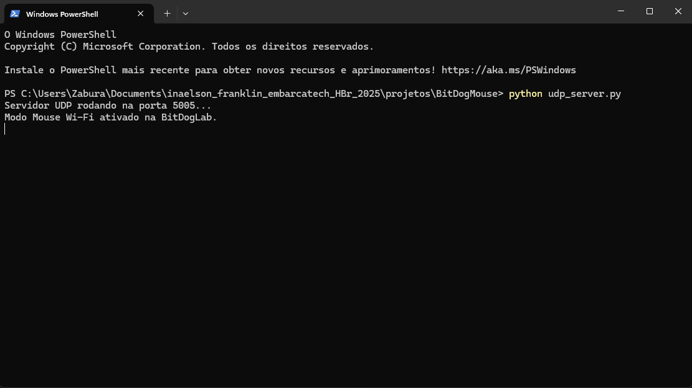

# BitDogMouse

Este projeto implementa uma aplicação para ligar o PC remotamente (Wake-On-Lan) e de controle do cursor do mouse via Wi-Fi, através de um servidor UDP.

## Objetivo

Utilizar a BitDogLab para ligar o PC à distância e controlar a posição do cursor do mouse via Wi-Fi.

##  Lista de materiais: 

| Componente            | Conexão na BitDogLab      |
|-----------------------|---------------------------|
| BitDogLab (RP2040)    | -                         |
| Botão de pressão tátil | Botão A: GPIO5 / Botão B: GPIO6 |
| Joystick Analógico KY023 | VRY (GPIO26), VRX (GPIO27), SW (GPIO22) |

## Execução

1. Abra o projeto no VS Code, usando o ambiente com suporte ao SDK do Raspberry Pi Pico (CMake + compilador ARM);
2. Dentro do diretório src, abra o arquivo **wifi_config.h** e faça as substituições de IP, MAC e credenciais de rede seguindo os comentários disponíveis no código;
3. Compile o projeto normalmente (Ctrl+Shift+B no VS Code ou via terminal com cmake e make);
4. Conecte sua BitDogLab via cabo USB e coloque a Pico no modo de boot (pressione o botão BOOTSEL e conecte o cabo);
5. Copie o arquivo .uf2 gerado para a unidade de armazenamento que aparece (RPI-RP2);
6. A Pico reiniciará automaticamente e começará a executar o código;
7. Aguarde o LED verde indicando sucesso na conexão via Wi-Fi;
8. Volte na raíz do repositório e abra o arquivo udp_sever.py em um editor de código;
9. Modifique o campo destinado ao IP da sua BitDogLab e salve;
10. Certifique-se de ter o Python instalado na sua versão mais recente;
11. Faça a instalação da biblioteca PyAutoGUI através do comando **pip install pyautogui**;
12. Execute o arquivo .py através do terminal acessando a raíz do projeto e digitando 
```bash
python udp_server.py
``` 
13. Será impresso no terminal a saída contendo a informação de que o modo Mouse foi ativado;
14. Tente movimentar o joystick.



## Lógica

### Para o modo Wake-On-Lan

- Ao ligar a BitDogLab, por padrão ela vai estar no modo Wake-On-Lan;
- Pressionando o Botão A, será enviado um pacote através da rede para e realizará o acionamento da maquina cujo endereço MAC foi ajustado anteriormente.

> [!NOTE]
> Para habilitar a função de Wake-On-Lan no seu sistema operacional, siga as instruções contidas no seguinte artigo: [Clique Aqui](https://www.dell.com/support/kbdoc/pt-br/000129137/o-que-%C3%A9-wake-on-lan-guia-de-solu%C3%A7%C3%A3o-de-problemas-e-pr%C3%A1ticas-recomendadas#Wake-PC)

### Para o modo Mouse

- Ao rodar o servidor que recebe os dados enviados via UDP na máquina, a BitDogLab irá automaticamente mudar para o modo mouse;
- A movimentação do joystick envia um valor de X e Y que variam de -10 á 10, de acordo com a distância do joystick em relação à posição original;
- Esses valores são acrescidos ou reduzidos das coordenadas atuais do cursor na tela;

##  Arquivos

- `BitDogUtilities.c`: Código principal do projeto;
- `udp_server.py`: Servidor UDP para recebimento de pacotes de dados da BitDogLab;
- `buttons_irq.c`: Configurações das interrupções para os botões;
- `joystick_adc.c`: Código para a leitura do joystick via conversor AD;
- `mouseFunction.h`: Arquivo de cabeçalho com variáveis e funções referentes ao modo mouse;
- `wake_on_lan.c`: Código de preparação do magic packet para o Wake-On-Lan;
- `wifi_config.c`: Código para habilitar e realizar a conexão Wi-Fi daa BitDogLab;
- `wifi_config.h`: Arquivo de cabeçalho contendo dados de rede e bibliotecas para a comunicação Wi-Fi;
- `assets/udp_server.png`: Tela do terminal após rodar servidor com sucesso.

---

## 📜 Licença
MIT License - MIT GPL-3.0.
